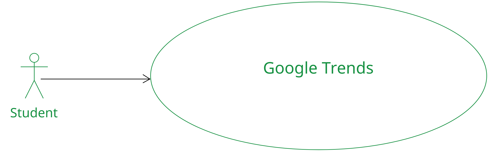
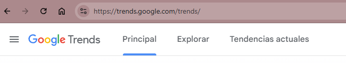
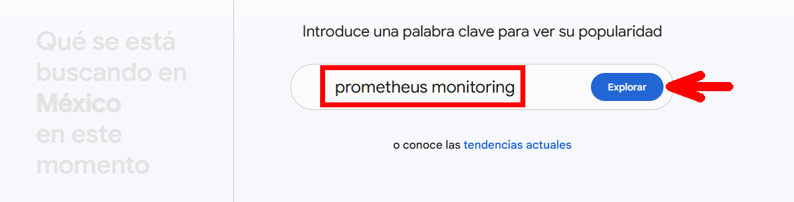
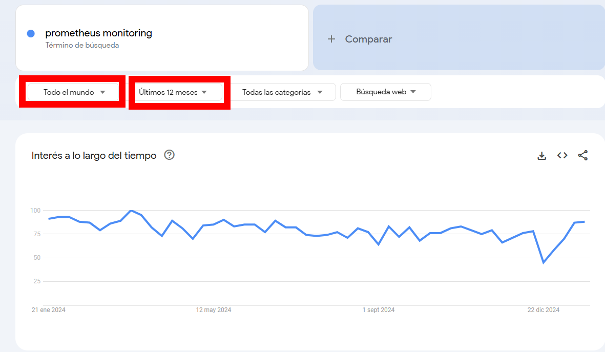
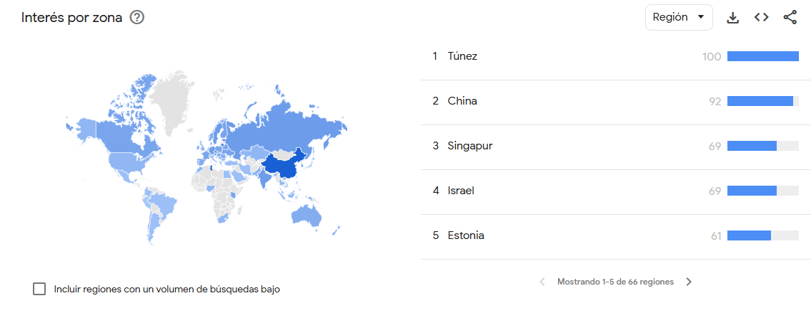
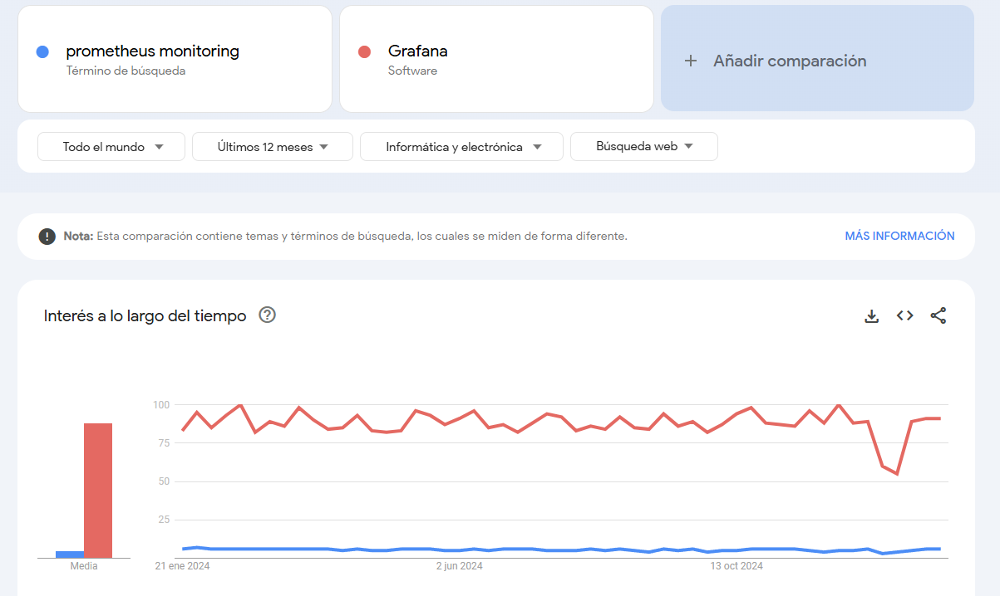
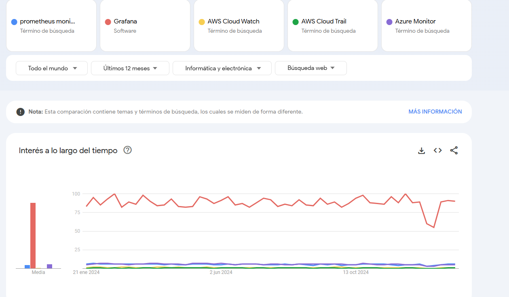

# 1. Comparación de herramientas

En este laboratorio se busca que el alumno pueda investigar la popularidad de prometheus y grafana en el mundo. 

## Objetivos
- Investigar el uso de prometheus en el mundo
- Investigar el uso de grafana en el mundo
- Comparar las herramientas con otras

---
<!--Este fragmento es la barra de 
navegación-->

        <table width="50%">
            <tr>
                <td style="text-align: center;">
                    
                     anterior
                </td>
                <td style="text-align: center;">
                   <a href="../README.md">Lista Laboratorios</a>
                </td>
<td style="text-align: center;">
                    
                     siguiente
                </td>
            </tr>
        </table>

---

## Diagrama 

Se espera que el alumno realice una investigación usando Google Trends 

## Instrucciones 

1. Abrir un explorador web **Google Chrome**, **Safari**, **Edge**, o el de su preferencia.

2. Abrir el siguiente url: https://trends.google.com/trends/

 

3. Usar el buscador de **Google Trends**, escribir **prometheus monitoring** y pulsar explorar:

4.  Por defecto mostrará las tendencias del día anterior y de la región actual. 

5. Modificar la región a **todo el mundo** y **Últimos 12 meses**

6. Analizar los resultados y observar en que paises es tendencia prometheus

7. Compara con Grafana 

> **Nota**: *A pesar que podemos observar diferencias a nivel tendencias, **recuerda que cada herramienta se usa en escenarios diferentes***

8. En la comparativa agrega otras herramientas de minotoreo que conozcas y comparalas. 

# Resultado esperado

Se espera que el alumno pueda observar un gráfico cómo el siguiente: 

