# 2. Instalación de Prometheus y Grafana con Docker
En este laboratorio se busca configurar a prometheus y grafana dentro de la tecnología de contenedores. 


## Objetivos
- Comprender la configuración de Docker.
- Usar comandos para crear un contenedor de prometheus.
- Usar comandos para crear un contenedor de grafana.
- Explorar las herramientas. 

---
<div style="width: 400px;">
        <table width="50%">
            <tr>
                <td style="text-align: center;">
                    <a href="../Capitulo1/"></a>
                    <br>anterior
                </td>
                <td style="text-align: center;">
                   <a href="../README.md">Lista Laboratorios</a>
                </td>
<td style="text-align: center;">
                    <a href="../Capitulo3/">
                    </a>
                    <br>siguiente
                </td>
            </tr>
        </table>
</div>

---

## Diagrama

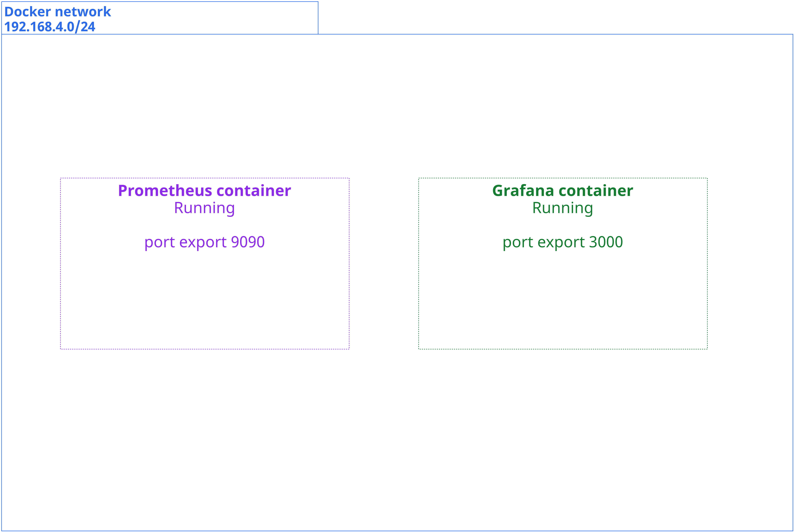

<br>


## Instrucciones

### Configuración de prometheus en docker

1. Abrir una terminal dentro de un servidor que tenga docker instalado. 

2. Validar que docker este instalado con el comando 

```bash
docker version
```

3. Crear una red de docker con el siguiente comando:

```bash
docker network create --subnet 192.168.4.0/24 --gateway 192.168.4.1 monitor
```
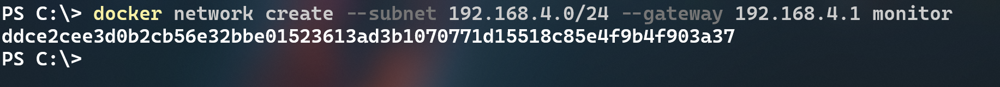


4. Ahora crearemos el contenedor de prometheus con el siguiente comando:

>**Nota:** Esta primer versión de prometheus no llevará configuración adicional. 

```bash
docker run -p 9090:9090 --name prometheus --network monitor -d  prom/prometheus:latest
```

>**IMPORTANTE:** Cuando se ejecute el comando por primera vez tardará un poco por la descarga de la imagen de prometheus. En el caso de error cambiar la imagen a **edgardovefe/pgclase:prometheus**

5. Validar que el contenedor este iniciado con el comando:

```bash
docker ps
```

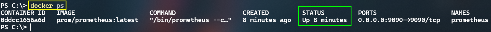

6. Ahora abrir un explorador web y abrir la siguiente dirección: http://localhost:9090

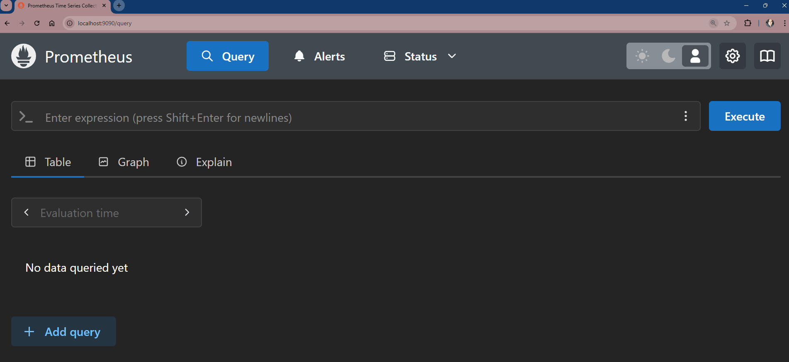

>**Nota:** Al abrir la dirección localhost:9090 podrás observar el dashboard de prometheus.

7. Abre la dirección http://localhost:9090/metrics para observar las métricas de prometheus. 

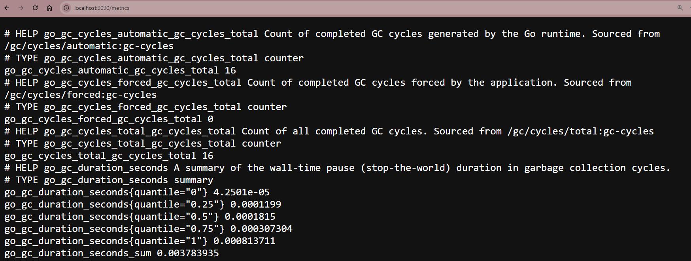


8. Explora la configuración actual de prometheus **Status->Configuration**, podrás observar un archivo **yaml**: 

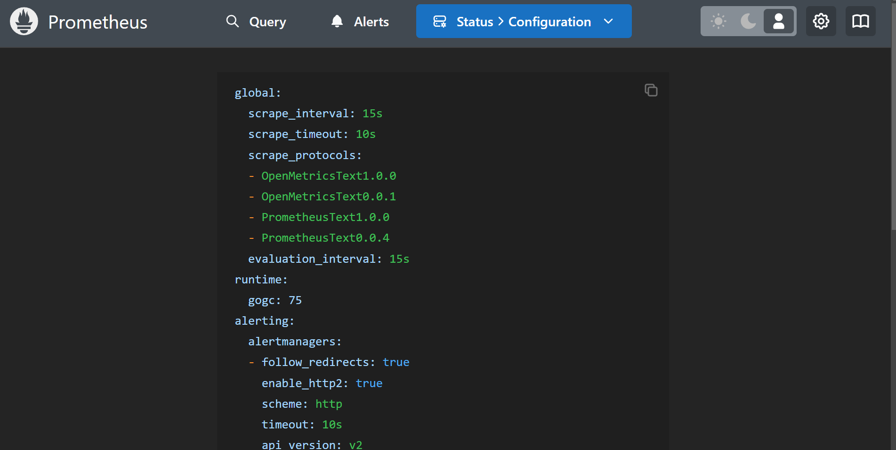

>**Nota:** Analiza la configuración que esta por default.


## Configuración de grafana en docker
1. Para configurar a grafana en docker asegurate que tengas la red **monitor en docker** puedes validar si existe con el siguiente comando:

```bash
docker network ls
```
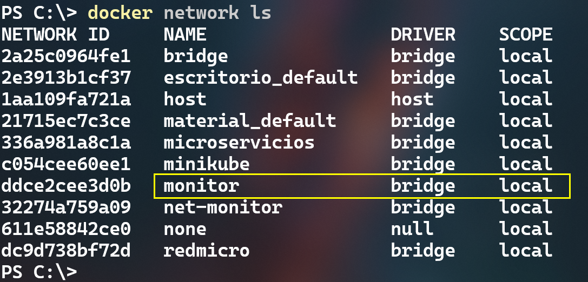

2. Usaremos la versión open source de grafana para las pruebas. 

3. Ejecutar el siguiente comando:

```bash
docker run -p 3000:3000 --name grafana -e GF_SECURITY_ADMIN_PASSWORD=pass --network monitor -d grafana/grafana-oss:latest
```

>**Nota:** El comando anterior crear un contenedor con grafana y el password de inicio es **pass**

4. Verifica que el contenedor este iniciado con el comando:

```bash
docker ps
```

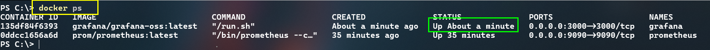


5. Abrir un explorador web y abrir la siguiente dirección: http://localhost:3000 

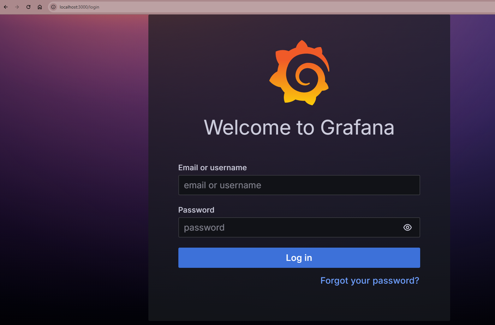

6. Escribir el usuario y contraseña para entrar al panel de grafana:
- **user**: admin
- **password**: pass


## Resultado esperado

Se espera que el alumno tenga las 2 plataformas iniciadas, tanto prometheus como grafana. 

## Prometheus
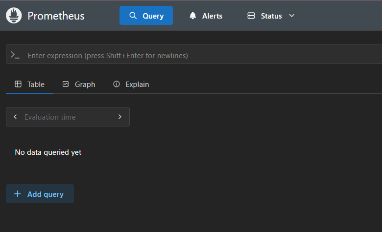

## Grafana
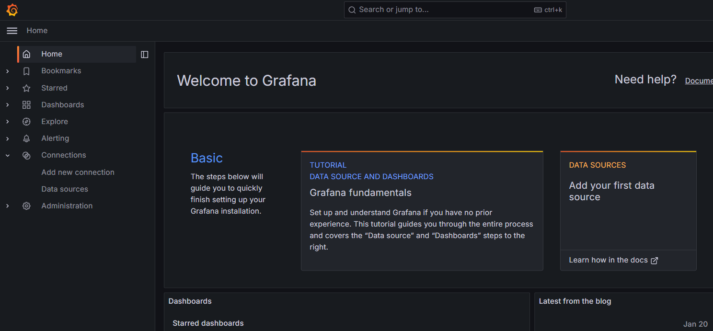