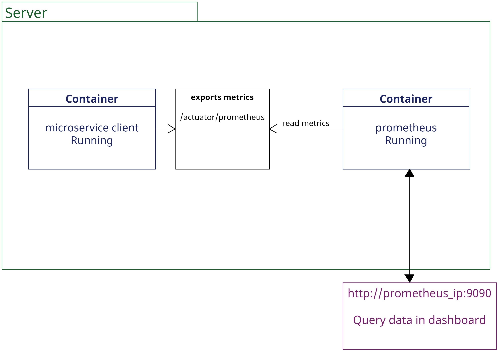
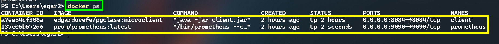
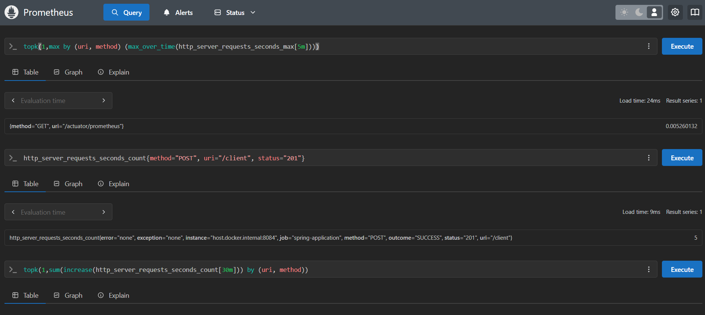

# Práctica 3. Consultas promql de las métricas de un microservicio 
Se espera que el alumno aprenda a conectar un microservicio a prometheus y realice consultas usando promql. 

## Objetivos
- Levantar un microservicio usando docker.
- Conectar el microservicio a Prometheus.
- Realizar consultas de las métricas usando promql.

## Duración aproximada:
- 60 minutos.
  
---

<div style="width: 400px;">
        <table width="50%">
            <tr>
                <td style="text-align: center;">
                    <a href="../Capitulo2/"></a>
                    <br>anterior
                </td>
                <td style="text-align: center;">
                   <a href="../README.md">Lista Laboratorios</a>
                </td>
<td style="text-align: center;">
                    <a href="../Capitulo4/"></a>
                    <br>siguiente
                </td>
            </tr>
        </table>
</div>

---


## Diagrama




## Instrucciones
Este laboratorio esta separado en las siguientes secciones:

- ### [Levantar microservicio cliente](#levantar-microservicio-return)
- ### [Configurar prometheus](#configurar-prometheus-return)
- ### [Consultas promql](#consultas-promql-return)

## Levantar microservicio [return](#instrucciones)
1. Es necesario que se tenga docker iniciado, validar con el siguiente comando:

```bash
docker ps
```
> **NOTA:** el comando anterior le muestra los contenedores iniciados, en caso de que el comando marque algún error, docker no esta iniciado. 

2. Crear un contenedor con el microservicio cliente ejecutandose:

```bash
docker run -p 8084:8084 --name client -d edgardovefe/pgclase:microclient
```

> **NOTA:** El comando anterior crea un contenedor con una aplicación con la siguientes características:
> - tecnología: spring boot
> - lenguaje: java
> - puerto: 8084

3. Validar que el contenedor este iniciado con el comando:

```bash
docker ps
```


4. Abrir **postman** o **insomnia** y ejecutar la siguiente consulta: 

```bash
curl -L 'http://localhost:8084/actuator/prometheus'
```

**salida**


> **NOTA:** la imagen anterior representa a las métricas de la aplicación web. 

5. Ejecutar las siguientes operaciones en **postman** ó **insomnia** para añadir más información a las métricas:

- **insertar**

```bash
curl -L 'http://localhost:8084/client' \
-H 'Content-Type: application/json' \
--data-raw '{
    "name":"zaira",
    "address":"su casa",
    "email":"zaria@gmail.com"
}'
```


- **actualizar**

```bash
curl -L -X PUT 'http://localhost:8084/client' \
-H 'Content-Type: application/json' \
--data-raw '{
    "id":2,
    "name":"zaira",
    "address":"su nueva casa",
    "email":"zaria@gmail.com"
}'
```

- **eliminar**

```bash
curl -L -X DELETE 'http://localhost:8084/client?id=2'
```
- **obtener todos**

```bash
curl -L 'http://localhost:8084/client'
```

- **buscar por id**

```bash
curl -L 'http://localhost:8084/client/id?id=1'
```


## Configurar Prometheus [return](#instrucciones)

1. Para configurar Prometheus el **microservicio cliente** debe de estar iniciado, en caso de que no sea así, regresa a la sección anterior. 

2. En el escritorio crear un archivo que llamaremos **prometheus.yml**.

3. En el archivo **prometheus.yml** añadir el siguiente contenido:

```yaml
scrape_configs:
  - job_name: 'spring-application'
    metrics_path: '/actuator/prometheus'
    scrape_interval: 5s
    static_configs:
      - targets: ['host.docker.internal:8084']
```

4. Ahora obtenemos la ruta absoluta de nuestro archivo **prometheus.yml**, se debería de ver cómo lo siguiente:

```bash
C:\Users\egar2\Escritorio\volume\prometheus.yml
```

5. Crear un contenedor con la configuración de Prometheus cargada: 

```bash
docker run -p 9090:9090 --name prometheus -v 'path_promethus_file:/etc/prometheus/prometheus.yml' -d prom/prometheus:latest
```

> **NOTA:** Sustituir **path_prometheus_file** por la ruta absoluta de su archivo prometheus.yml

6. Validar que su contenedor este iniciado con el comando:

```bash
docker ps
```

> **IMPORTANTE:** Para este punto del laboratorio debería de tener 2 contenedores iniciados, uno con Prometheus y el otro con el microservicio.




7. Abrir un explorador web y abrir el portal de **Prometheus**, http://localhost:9090


8. En el portal de Prometheus abrir **Status-> Target Health** y validar que nuestro microservicio este conectado: 


## Consultas promql [return](#instrucciones)

1. Mostrar la cantidad de veces que se ha insertado un cliente y ha sido exitoso:

```bash
http_server_requests_seconds_count{method="POST", status="201"}
```


2. Mostrar la cantidad de veces donde no se ha encontrado a un cliente al buscar por id.

```bash
http_server_requests_seconds_count{method="GET", uri="/client/id", status="404"}
```


3. Mostrar la operación más lenta de los últimos 5 minutos:

```bash
topk(1,max by (uri, method) (max_over_time(http_server_requests_seconds_max[5m])))
```


4. Mostrar la operación más ejecutada del microservicio en los últimos 30 min:


```bash
topk(1,sum(increase(http_server_requests_seconds_count[30m])) by (uri, method))
```


## Resultado esperado [Instrucciones](#instrucciones)


En el panel de Prometheus debería de tener varias consultas, y se vería de la siguiente forma: 




