# 4. Dashboard de aplicación web

Se necesita que el alumno ayude a crear un panel de monitoreo para el microservicio desplegado en el laboratorio [(Capítulo 3)](../Capitulo3/) anterior.

## Objetivos
- Conectar prometheus con grafana
- Realizar consultas para extraer información de prometheus
- Usar las visualizaciones de grafana para representar información de la aplicación. 
- Configurar un panel de monitoreo

---

<div style="width: 400px;">
        <table width="50%">
            <tr>
                <td style="text-align: center;">
                    <a href="../Capitulo3/"></a>
                    <br>anterior
                </td>
                <td style="text-align: center;">
                   <a href="../README.md">Lista Laboratorios</a>
                </td>
<td style="text-align: center;">
                    <a href="../Capitulo5/"></a>
                    <br>siguiente
                </td>
            </tr>
        </table>
</div>

---

## Diagrama

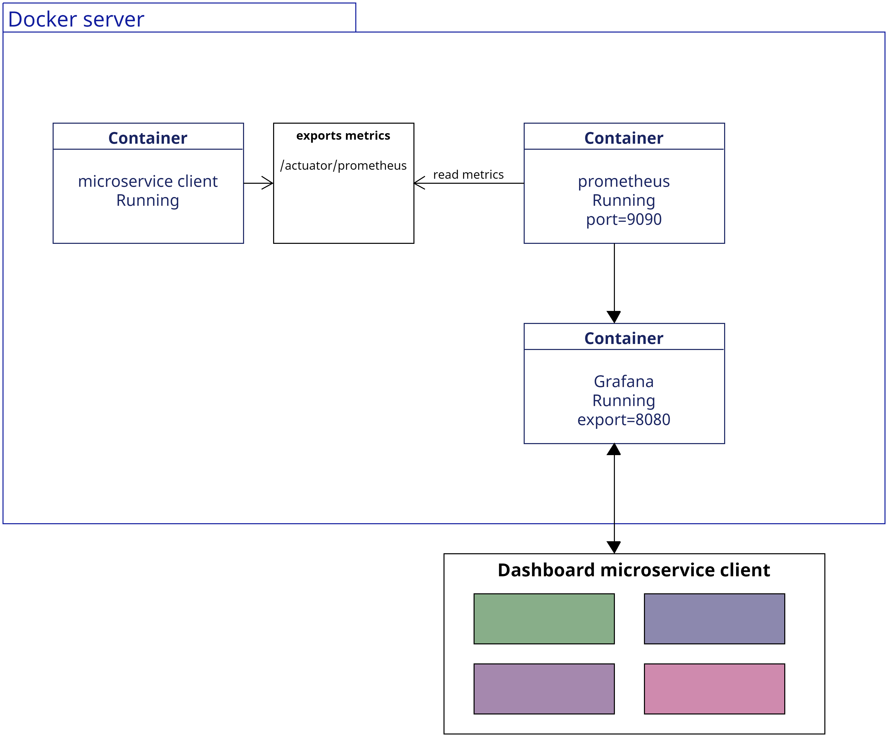

>**IMPORTANTE**: Para este laboratorio usaremos la conexión de prometheus con el microservicio cliente, en el caso de NO tenerlo, **realizar el laboratorio anterior [Capítulo3](../Capitulo3/)**


## Instrucciones
Este lab esta separado por las siguientes secciones:

- **[Configurar Prometheus con Grafana](#configurar-prometheus-con-grafana-return)**

- **[Crear panel de monitoreo](#crear-panel-de-monitoreo-return)**

- **[Crear visualización "Estado del microservicio"](#crear-visualización-estado-del-microservicio-return)***

- **[Crear visualización "Tasa de éxito en los últimos 30 min"](#crear-visualización-tasa-de-éxito-en-los-últimos-30-min-return)** 

- **[Crear visualización "Tasa de fallo en los últimos 30 min"](#crear-visualización-tasa-de-fallo-en-los-últimos-30-min-return)**

- **[Crear visualización "Logs totales"](#crear-visualización-logs-totales-return)**

## Configurar prometheus con grafana [return](#instrucciones)
1. Para esta primera parte es necesario tener conectado el microservicio cliente con prometheus, en el caso de no tenerlo **REALIZAR PRÁCTICA 3**

2. Crear un contenedor de grafana en docker con el siguiente comando:
> **NOTA:** Si ya tienes un contenedor con grafana sólo tienes que iniciarlo con el comando **docker start namecontainer**

```bash
docker run -p 3000:3000 --name grafana -e GF_SECURITY_ADMIN_PASSWORD=pass --network monitor -d grafana/grafana-oss:latest
```

3. Abrir en un navegador web la siguiente dirección: http://localhost:3000, nos pedira un usuario
y contraseña, **user:admin, password:pass**

    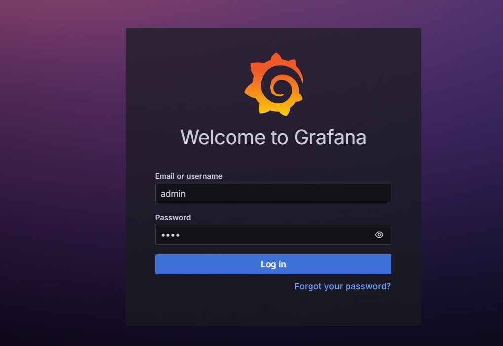

4. Abrir la barra de navegación abrir **Connections -> Data sources** 

    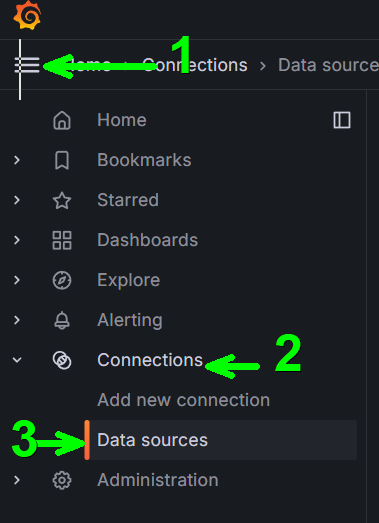


5. Ahora **add Datasources** selecciona **prometheus** y en **connection** añadir la siguiente dirección **http://host.docker.internal:9090** es la dirección del contenedor de prometheus:

    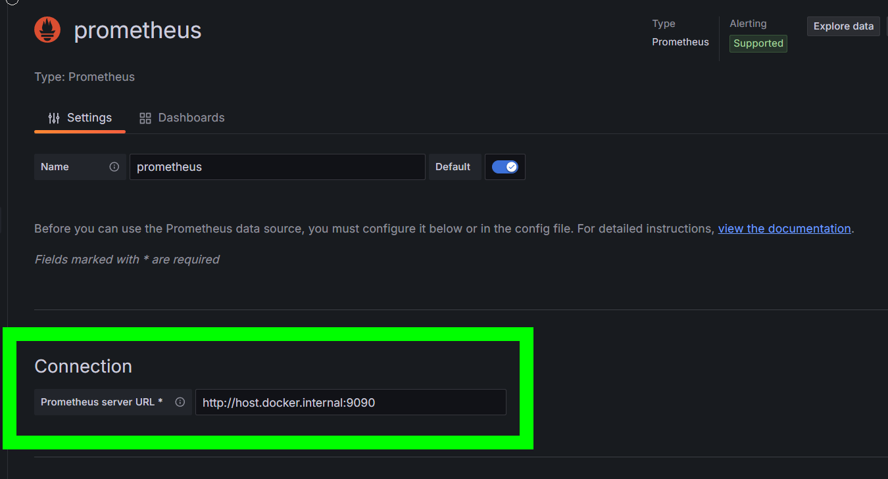

6. Salva la conexión **Save & test**

    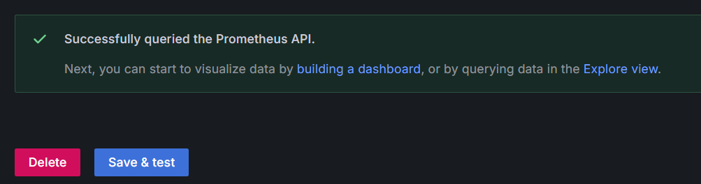


## Crear panel de monitoreo [return](#instrucciones)

1. En la barra de navegación de grafana selecciona **dashboards**

    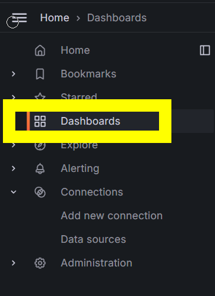

2. Ahora **New-> new dashboard**

3. En **Settings** del **dashboard** configura el nombre **Microservicio cliente** -> **Save dashboard**

    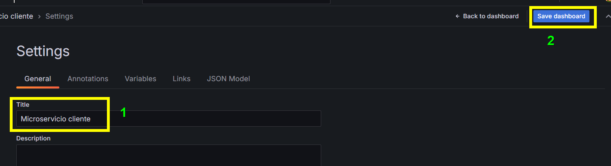


## Crear visualización "Estado del microservicio" [return](#instrucciones)
1. Dentro del dashboard **Microservicio cliente** selecciona **Add Visualization**

2. Selecciona el **data source prometheus**

3. En la sección de queries añade la siguiente consulta: 

```bash
up{job="spring-application"}
```
>**NOTA:** La consulta anterior nos entrega un **1 si el servicio esta funcionando**, **0 si esta apagado** ó un **null si no hay datos**

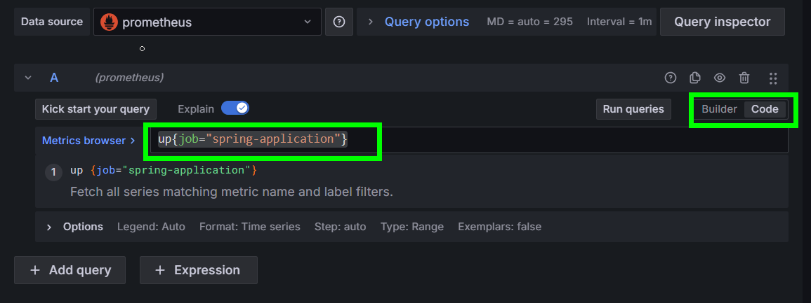

4. Cambiar el tipo de gráfico a **stat** 

    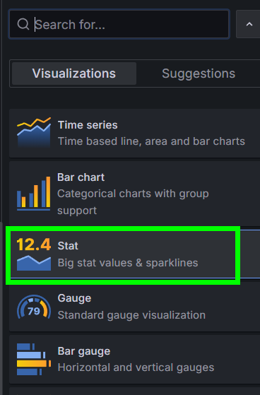

5. En las opciones del gráfico cambiar el nombre a **Estado del microservicio**

>**NOTA:** Si observamos, hasta el momento sólo vemos un gráfico con el número **1**
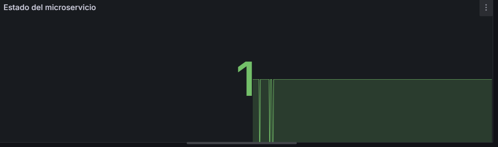

6. Agregar **Value mappings**  dentro de la configuración del gráfico: 

    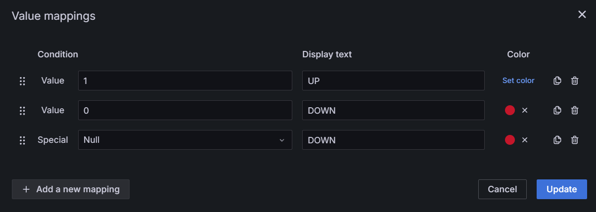

7. **Salva el dashboard** y acomoda tu visualización al tamaño que prefieras

    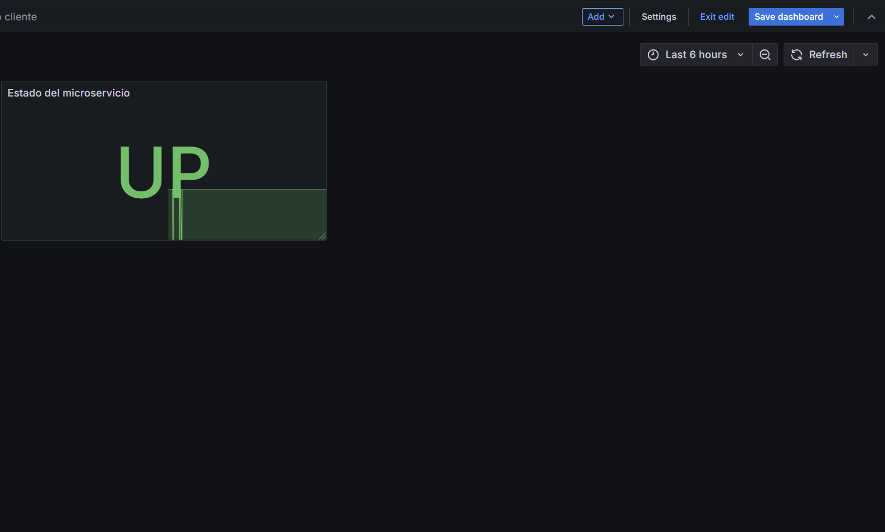


## Crear visualización "Tasa de éxito en los últimos 30 min" [return](#instrucciones)

1. En el dashboard Microservicio Cliente agregar una nueva visualización **Add->Visualization**

2. En la sección de queries añadir la siguiente consulta:

```bash
100 * sum(rate(http_server_requests_seconds_count{job="spring-application", status=~"2.."}[30m])) / sum(rate(http_server_requests_seconds_count[30m]))
```
> **NOTA:** En la consulta anterior nos entrega el porcentaje de éxito de las operaciones del microservicio de los últimos 30 minutos.

3. En las opciones del query añadir el tag **Códigos 2XX** 

    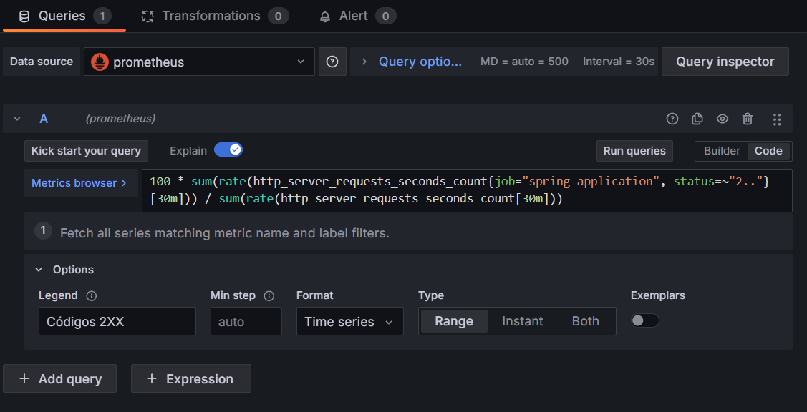


4. En las opciones del panel añadir la siguiente información:
- **Title:** Tasa de éxito en los últimos 30 minutos

5. **Save dashboard** y acomode el panel al tamaño que usted prefiera.

    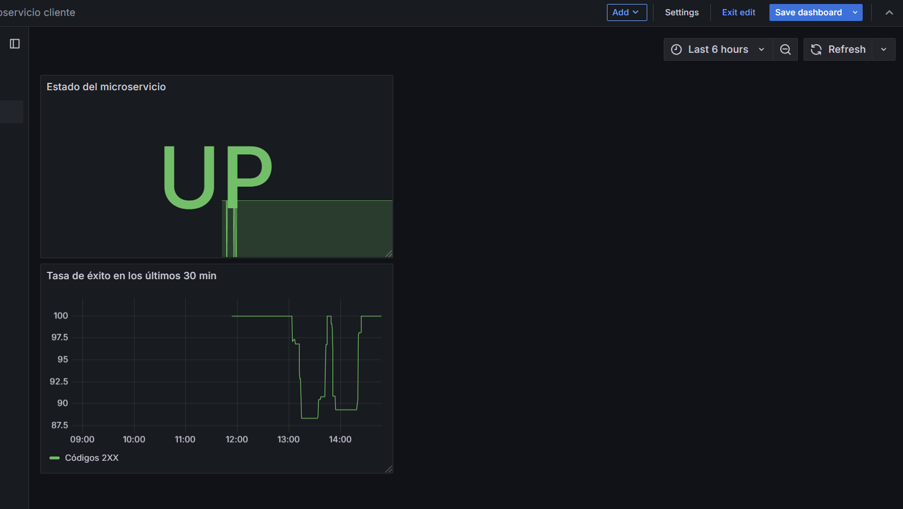

## Crear visualización "Tasa de fallo en los últimos 30 min" [return](#instrucciones)
1. Dentro del dashboard **Microservicio Cliente** Añadir una nueva visualización **Add->Visualization**

2. Añadir la siguiente consulta **promql** en la sección de **query**

```bash
100 * sum(rate(http_server_requests_seconds_count{job="spring-application", status=~"4..|5.."}[30m])) / sum(rate(http_server_requests_seconds_count{job="spring-application"}[30m]))
```

> **NOTA:** La consulta anterior me retorna el porcentajes de fallas de los últimos 30 minutos del microservicio cliente.

3. En las opciones de la consulta añadir la etiqueta **Códigos 4XX y 5XX**

    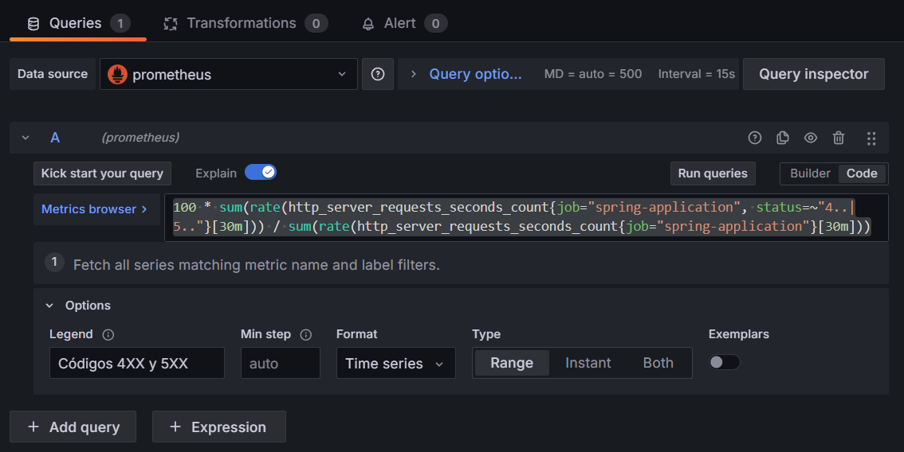

4. Seleccionar el tipo de gráfico **Time Series**

5. En las opciones del Gráfico modificar las siguientes opciones:
- **Title:** Tasa de fallo en los últimos 30 min
- **Fill opacity:** 40
- **Gradient Mode:** Opacity
- **Color Scheme:** Reds (By value)

6. **Save Dashboard** y acomodar la visualización del tamaño que quiera. 

    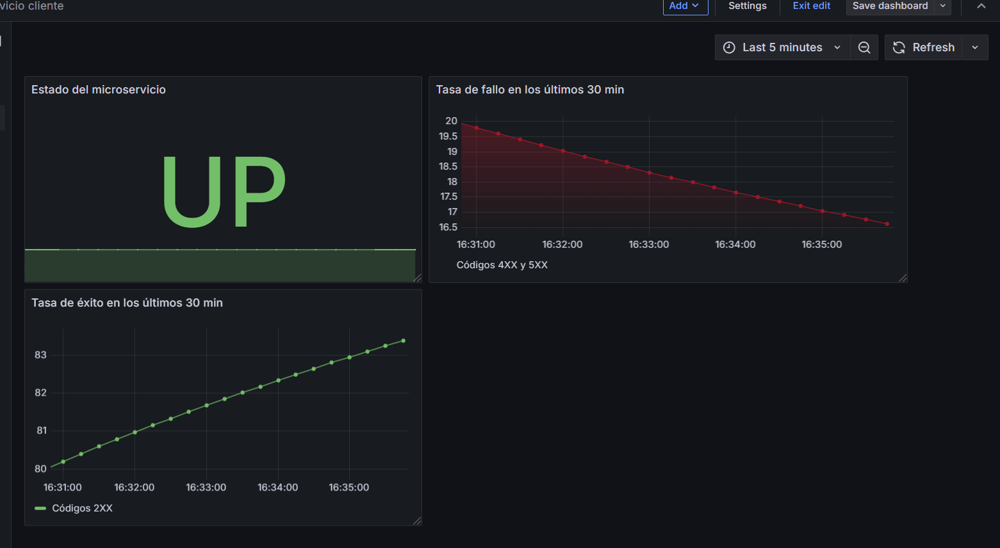


## Crear visualización "Logs totales" [return](#instrucciones)
1. Dentro del dashboard **Microservicio cliente** añadir una nueva visualización **Add -> visualization**

2. En la sección de **Query** añadir la siguiente consulta **promql**:

```bash
sum  by (level) (logback_events_total{job="spring-application"})
```

> **NOTA:** La consulta anterior nos agrupa por nivel los logs generados por el microservicio

3. Cambiar el tipo de gráfico a  **Bar gauge**

4. Dentro de las configuraciones del gráfico modificar:
- **Title:** Logs totales
- **Display mode:** Retro LCD
- **Value display:** Text color
- **Color Scheme:** Classic palette

5. **Save dashboard** y modificar el tamaño de la visualización al que usted quiera. 

    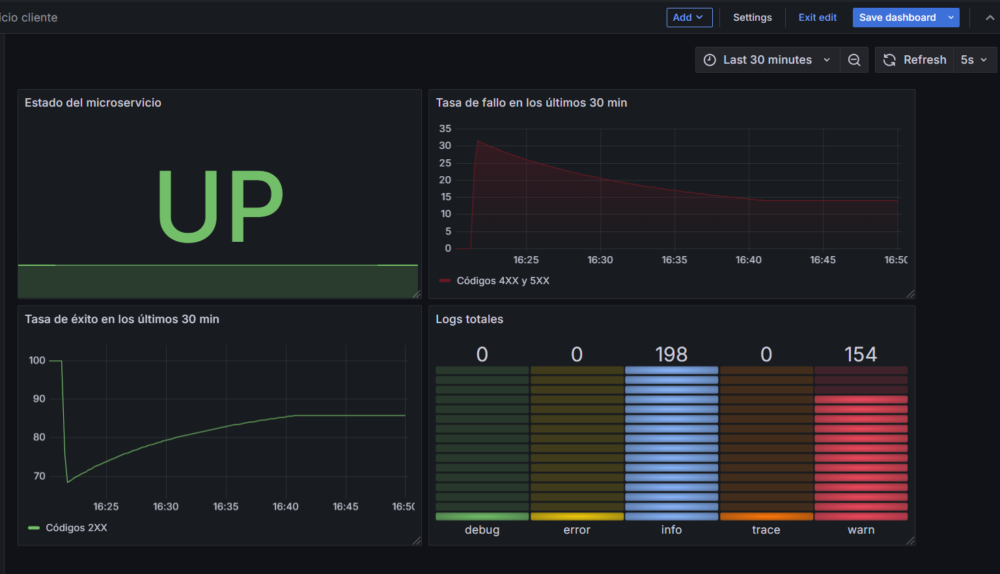

## Resultado Esperado 
Cuando finalize el laboratorio se espera que el alumno tenga un dashboard para su microservicio cliente. 

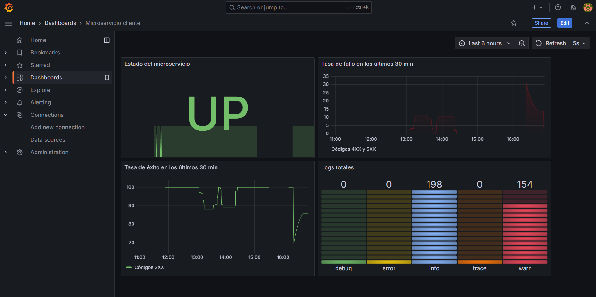

