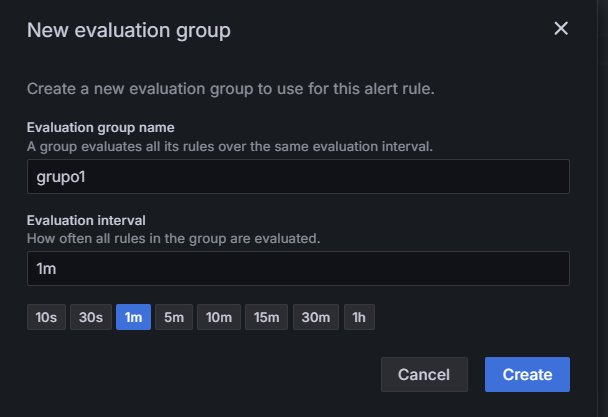

# 5. Crear alertas de un microservicio en Grafana
Se necesita crear una alerta que le avise al equipo cuando un microservicio se ha caido. 

## Objetivos
- Observar las opciones de alertas que tiene grafana
- Conectar grafana a un webhook 
- Configurar un punto de conexión
- Crear un template personalizado de alertas
- Activar una alerta

---
<div style="width: 400px;">
        <table width="50%">
            <tr>
                <td style="text-align: center;">
                    <a href="../Capitulo4/"></a>
                    <br>anterior
                </td>
                <td style="text-align: center;">
                   <a href="../README.md">Lista Laboratorios</a>
                </td>
<td style="text-align: center;">
                    <a href="../Capitulo6/"></a>
                    <br>siguiente
                </td>
            </tr>
        </table>
</div>

---

> **IMPORTANTE:** Para este laboratorio es importante tener configurados los siguientes contenedores 
**microservicio cliente**, **prometheus** y **grafana**
en el caso de no tenerlo es importante revisar los laboratorios **3** y **4** de esta guía. 


## Diagrama


## Instrucciones
Este laboratorio esta separado las siguientes  secciones.

- **[Configuración teams](#configuración-teams-return)**
- **[Conexión teams con Grafana](#conexión-teams-con-grafana-return)**
- **[Creación de template](#creación-de-template-return)**
- **[Crear alerta de grafana](#crear-alerta-de-grafana-return)**

## Configuración teams [return](#instrucciones)
1. Para esta sección necesitaremos una cuenta de **microsoft teams** que nos permita crear canales. 

2. En la sección de **equipos** crear un nuevo canal con el nombre que quieras. 

    

3. El canal tendrá las siguientes opciones:

    

4. Ahora en el canal **Administración del canal-> Configuración -> Conectores** 

    

5. Dentro de conectores buscar **Incoming Webhook** este conector va a permitir que grafana pueda enviar alertas al canal de teams

    

6. Cambiar del webhook el **nombre** y la **imagen**

    

7. Al crear el **webhook** nos va a generar un url **Copiamos y guardamos el url webhook**

    

8. Guarde el url **Webhook url** lo usaremos en la sección de grafana

## Conexión teams con Grafana [return](#instrucciones)

1. En el menu de grafana buscaremos la opción **Alerting->Contact points**

    

2. Crear un nuevo **Contact point** con la siguiente configuración:
- **Name:** Teams Contact
- **Integration**: Microsoft Teams
- **URL**: ***Webhook url copiado de teams***

    


3. **Save Contact point**


## Creación de template [return](#instrucciones)

1. Abrir el **contact point** creado
2. Abrir las opciones **Optional Microsoft Teams settings** y configurar:
- **Title**: Grafana alerta
- **Message**: Añadir el siguiente código:

```go
{{ if eq .Status "firing" }}
☣️ALERTA CRITICA☣️
- Estado de alerta: {{ .Status }}
{{ range .Alerts }}
- application: {{ index .Labels  "microservice"}}
{{ end }}
{{ else }}
☑️ESTADO SOLUCIONADO☑️
- Estado de alerta: {{ .Status }}
- Receiver: {{ .Receiver }}
{{ range .Alerts }}
- application: {{ index .Labels "microservice" }}
{{ end }}
{{ end }}

```
3. Guardar y probar la alerta, al probarla en nuestro canal de teams deberíamos de observar lo siguiente:

    


## Crear alerta de grafana [return](#instrucciones)

1. Ahora en el menú de grafana abrir **Alert rules**

    

2. La alerta tendrá la siguiente configuración:
- **Name**: Alerta microservicio cliente
- **Query**: Mostrar si el microservicio esta en estado up
```bash
up{job="spring-application"}
```


- **Threshold**: Si el microservicio esta apagado:

    

- **Folder**: Alertas microservicio

- **Evaluation group**: Cada minuto

    

- **Add Labels**: 
    - microservice: client
    
        

- **Contact Point:** Teams Contact

    

3. **Save rule and exit**

4. Esperar un poco hasta que la alerta se active. 


## Resultado Esperado [Instrucciones](#instrucciones)

1. Para probar la alerta es necesario prender y apagar el microservicio cliente

```bash
#----apagar contenedor----
docker stop client 

#----prender contenedor----
docker start client
```

> **NOTA:** Esperar unos 2 minutos entre apagado y prendido para darle tiempo a la alerta. 

