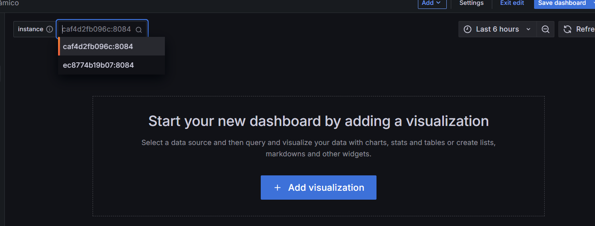

# Práctica 6. Panel dinámico Grafana
Se requiere que el alumno creé un panel dinámico en grafana tomando en cuenta un servicio de descubrimiento. 

## Objetivos
- Configurar prometheus para el autodescubrimiento de servicios.
- Iniciar Docker-compose para la orquestación de múltiples microservicios. 
- Crear panel con variables en Grafana.

## Duración aproximada:
- 60 minutos.
  
---

<div style="width: 400px;">
        <table width="50%">
            <tr>
                <td style="text-align: center;">
                    <a href="../Capitulo5/"></a>
                    <br>anterior
                </td>
                <td style="text-align: center;">
                   <a href="../README.md">Lista Laboratorios</a>
                </td>
<td style="text-align: center;">
                    <a href="../Capitulo7/"></a>
                    <br>siguiente
                </td>
            </tr>
        </table>
</div>

---


## Diagrama


## Instrucciones
Este laboratorio se separa en las siguientes secciones:

- **[Archivo configuración prometheus](#archivo-de-configuración-prometheus-return)**

- **[Docker Compose](#docker-compose-return)**

- **[Panel con variables](#panel-con-variables-return)**

## Archivo de configuración prometheus [return](#instrucciones)
1. Crear un archivo una carpeta en el escritorio que llamaremos **clase**.
2. Dentro de la carpeta crear un archivo con el nombre **prometheus.yaml**.
3. En el archivo **prometheus.yaml** añadir el siguiente contenido:

```yaml

scrape_configs:
  - job_name: 'eureka'
    eureka_sd_configs:
      - server: 'http://eureka-server:9999/eureka'
    metrics_path: '/actuator/prometheus'
    scrape_interval: 5s
    relabel_configs:
      - source_labels: [__meta_eureka_app_name]
        target_label: 'application'
      - source_labels: [__meta_eureka_instance_hostname]
        target_label: 'instance'

```

4. Guardar el archivo y obtener su ruta absoluta.
Ejemplo:

```bash
C:\Users\egar2\Escritorio\clase\prometheus.yaml
```

## Docker Compose [return](#instrucciones)
1. En la carpeta **clase** que creamos en la sección anterior crearemos un archivo
llamado **docker-compose.yaml**.

2. En el archivo **docker-compose.yaml** añadiremos el siguiente contenido:

> **IMPORTANTE:** Dentro del contenedor **prometheus** en la sección **volumes** sustituir
**<path_yaml>** por el path de tu archivo **prometheus.yaml**


```yaml
services:
  prometheus:
    container_name: prometheus
    image: edgardovefe/pgclase:prometheus
    networks:
      - application
    volumes:
      - '<path_yaml>:/etc/prometheus/prometheus.yml'
    ports:
      - 9090:9090
  
  eureka-server:
    container_name: eureka-server
    image: edgardovefe/pgclase:eureka
    networks:
      - application
    ports:
      - 9999:9999
    healthcheck:
      test: curl -f http://localhost:9999
      
  clienti1:
    container_name: clienti1
    image: edgardovefe/pgclase:microclientv2
    networks:
      - application
    ports:
      - 8081:8084
    depends_on:
      eureka-server:
        condition: service_healthy
    environment:
      - IP_EUREKA=eureka-server
    healthcheck:
      test: curl -f http://localhost:8084/client
    
  clienti2:
    container_name: clienti2
    image: edgardovefe/pgclase:microclientv2
    networks:
      - application
    ports:
      - 8083:8084
    depends_on:
      eureka-server:
        condition: service_healthy
    environment:
      - IP_EUREKA=eureka-server
    healthcheck:
      test: curl -f http://localhost:8084/client

networks:
  application:
    ipam:
      driver: default
      config:
        - subnet: 192.168.32.0/24
          gateway: 192.168.32.1
```

3. Guardar el archivo **docker-compose.yaml**.
4. Abrir una terminal en la ubicación de tu archivo **prometheus.yaml**
y ejecutar el siguiente comando:

```bash
docker-compose up -d
```

> **NOTA**: El comando anterior levanta 4 contenedores, Prometheus, Eureka y 
2 instancias del microservicio cliente. 

5. Validar que sus 4 contenedores esten arriba con el siguiente comando:

```bash
docker ps
```


6. Abrir el dashboard (http://localhost:9090) de Prometheus y validar en **Status->Target health** que esten registrados tus 2 instancias de cliente. 


## Panel con variables [return](#instrucciones)

1. Abrir el panel (http://localhost:3000) de Grafana e iniciar sesión.

2. Crear un nuevo dashboard.

3. En los **Settings** del dashboard añadiremos la siguiente configuración:
- **Title**: Panel dinámico

4. En **Settings-> Variables** añadiremos una variable con la siguiente configuración:

- **Select variable type:** Query
- **Name:** instance
- **Label:** instance
- **Description:** instancias de microservicio cliente
- **Query Options:**
    - **query type:** Label values
    - **Label:** instance

5. Salvar el dashboard y observaremos algo similar:

    

6. Ahora crearemos una visualización.

7. En la visualización realizaremos la siguiente configuración:
- **Tipo gráfico:** Stat
- **Value mappings:**

    

- **Query:**
    ```bash
    up{instance="${instance}"}
    ```
- **Salvar el dashboard**

8. Acomodar tu visualización en el espacio que quieras. 

> **NOTA:** Si observas, el valor del panel cambia si cambias la instancia del microservicio. 


9. **(OPCIONAL)** Prueba crear más visualizaciones usando las variables en Grafana. 

## Resultado esperado [Instrucciones](#instrucciones)
Se espera que el alumno tenga un panel dinámico que cambie dependiendo de las variables seleccionadas en tus visualizaciones. 


