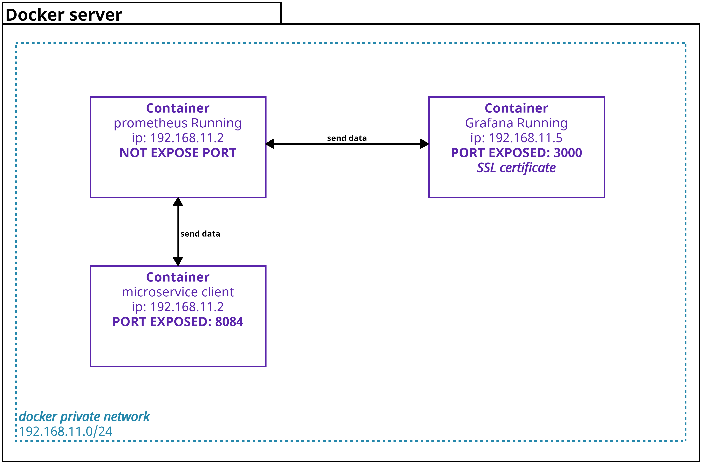
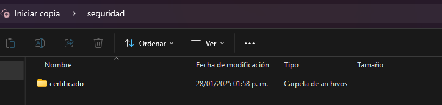
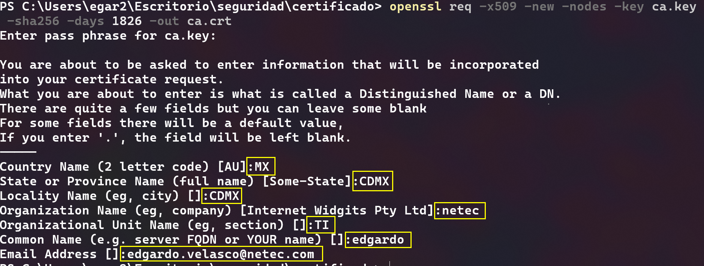
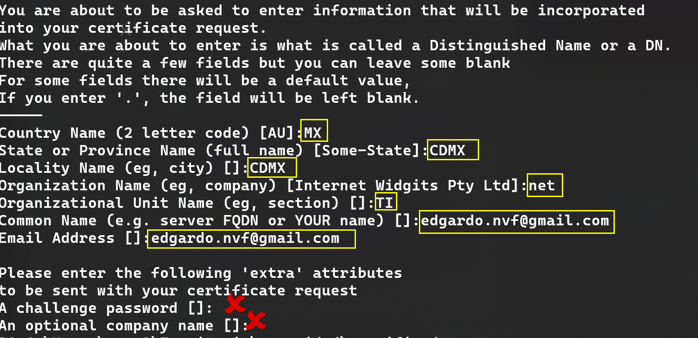
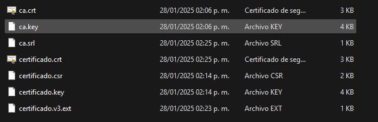
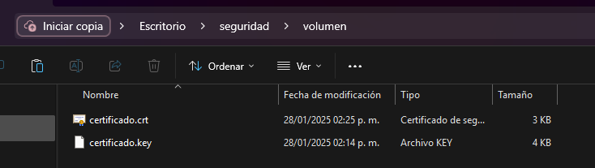
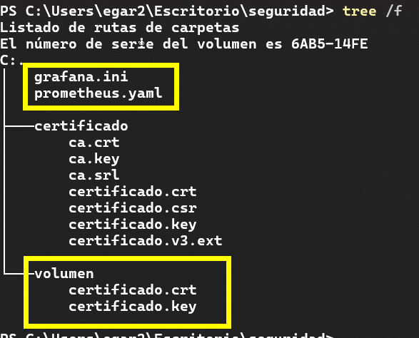
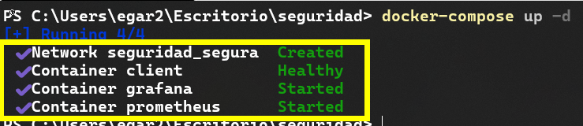
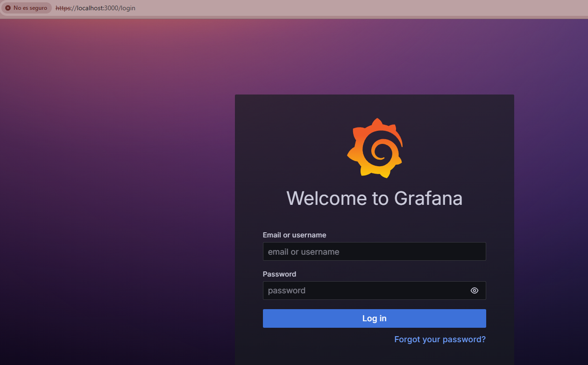
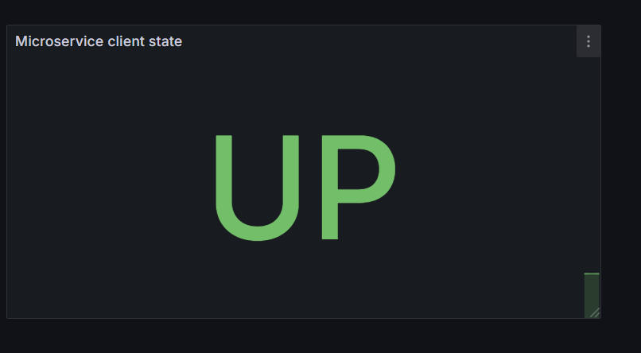

# Práctica 7. Implementando red segura y certificado SSL para Grafana

Se espera que el alumno implemente una red segura con un certificado SSL para cifrar la información de grafana.  

## Objetivos
- Crear un certificado autofirmado usando **openssl**.
- Crear los archivo de configuración de **Prometheus y Grafana**.
- Configurar un **docker compose** para el inicio de los contenedores.
- Validar el certificado **SSL** para Grafana.

## Duración aproximada:
- 60 minutos.
  
---

<div style="width: 400px;">
        <table width="50%">
            <tr>
                <td style="text-align: center;">
                    <a href="../Capitulo6/"></a>
                    <br>anterior
                </td>
                <td style="text-align: center;">
                   <a href="../README.md">Lista Laboratorios</a>
                </td>
<td style="text-align: center;">
                    <a href="../Capitulo8/"></a>
                    <br>siguiente
                </td>
            </tr>
        </table>
</div>

---


## Diagrama




## Instrucciones
Este laboratorio esta dividido en las siguientes secciones:

- **[Crear certificado SSL autofirmado](#crear-certificado-ssl-autofirmado-return)**

- **[Archivo de configuración prometheus](#archivo-de-configuración-prometheus-return)**
- **[Archivo de configuración grafana ](#archivo-de-configuración-grafana-return)**
- **[Docker-compose](#docker-compose-return)**

## Crear certificado SSL autofirmado [return](#instrucciones)

1. Crear una carpeta en el escritorio a la que llamaremos **seguridad**.
2. Dentro de la carpeta seguridad crear otra subcarpeta que llamaremos **certificado**.



3. Abrir una terminal dentro de la carpeta certificado.

4. Crear una llave primaria para el **CA**.

```bash
openssl genrsa -aes256 -out ca.key  4096
```
> **NOTA:** Al ejecutar el comando nos solicitará la **PEM pass phrase** escribir: **1234** (Guárdala, la usaremos después).

5. Crear un certificado para el **CA**.

```bash
openssl req -x509 -new -nodes -key ca.key  -sha256 -days 1826 -out ca.crt
```

> **NOTA:** Al ejecutar este comando nos pedirá la **PEM pass phrase** (1234), y la información para el CA, país, ciudad, empresa...etc.



6. Crear una **solicitud de firma de certificado y una llave** que usaremos en Grafana.

```bash
openssl req -new -nodes -out certificado.csr -newkey rsa:4096 -keyout certificado.key
```
> **NOTA:** Al ejecutar el comando anterior nos solicitará información cómo: país, ciudad, empresa y email  de la empresa que va a utilizar este certificado. 




7. En la carpeta **certificado**, crear un archivo de configuración que llamaremos **certificado.v3.ext** con la siguiente información: 

```bash
authorityKeyIdentifier=keyid,issuer
basicConstraints=CA:FALSE
keyUsage = digitalSignature, nonRepudiation, keyEncipherment, dataEncipherment
subjectAltName = @alt_names
[alt_names]
DNS.1 = localhost.local
DNS.2 = localhost.local
IP.1 = 192.168.11.5 #ip privada grafana
IP.2 = 127.0.0.1
```

> **NOTA:** El archivo certificado.v3.ext, se usa para indicar los permisos que tendra el certificado, es decir, para que será usado, en este caso se usará para **firma digital**.

8. Realizar el autofirmado de nuestro certificado usando nuestro **CA**, **CA private key** y el archivo **certificado.v3.ext** usando el siguiente comando:

```bash
openssl x509 -req -in certificado.csr -CA ca.crt  -CAkey ca.key -CAcreateserial -out certificado.crt -days 730 -sha256 -extfile certificado.v3.ext
```

> **NOTA:** El comando anterior nos pedirá el **PEM pass phrase (1234)** y nos creará un archivo **certificado.crt**.

9. En la carpeta **certificado** tendremos los siguientes archivos: 
 


10. Copiar los archivos **certificado.crt** y **certificado.key**.

11. En la carpeta **seguridad**, crear una nueva carpeta que llamaremos **volumen**. Pegar los archivos **certificado.crt** y **certificado.key**.



12. Copiar la ruta absoluta de la carpeta **volumen**, la usaremos después.

```bash
C:\Users\egar2\Escritorio\seguridad\volumen
```


## Archivo de configuración prometheus [return](#instrucciones)
1. Dentro de la carpeta **seguridad** crear un archivo que llamaremos **prometheus.yaml**.

2. Añadir el siguiente contenido al archivo **prometheus.yaml**.

```yaml
scrape_configs:
  - job_name: 'microservice-client'
    metrics_path: '/actuator/prometheus'
    scrape_interval: 5s
    static_configs:
      - targets: ['client:8084']
```

3. Guardar el archivo y obtener su ruta absoluta.

```bash
C:\Users\egar2\Escritorio\seguridad\prometheus.yaml
```


## Archivo de configuración grafana [return](#instrucciones)

1. En la carpeta **seguridad** crear un archivo que llamaremos **grafana.ini**.

2. En el archivo **grafana.ini** añadir el siguiente contenido: 

```ini
[server]
protocol = https
http_port = 3000
cert_file = /etc/grafana/certificates/certificado.crt
cert_key = /etc/grafana/certificates/certificado.key

[security]
admin_user = admin
admin_password = pass

[auth.anonymous]
enabled = false
```

3. Guardar el archivo y obtener su ruta absoluta. 

```bash
C:\Users\egar2\Escritorio\seguridad\grafana.ini
```


## Docker compose [return](#instrucciones)
1. Para crear el docker compose es imporante que el alumno tenga la siguiente estructura:



2. En la carpeta **seguridad** crear un archivo que llamaremos **docker-compose.yaml**.

3. Añadir el siguiente contenido al archivo **docker-compose.yaml**.

```yaml
services:
  prometheus:
    container_name: prometheus
    image: edgardovefe/pgclase:prometheus
    volumes:
      - '<path_prometheus>:/etc/prometheus/prometheus.yml'
    depends_on:
      client:
        condition: service_healthy
    ports:
      - 9090:9090
    networks:
      segura:
        ipv4_address: 192.168.11.2
    
  
  client:
    container_name: client
    image: edgardovefe/pgclase:microclient
    ports:
      - 8084:8084
    networks:
      segura:
        ipv4_address: 192.168.11.3
    healthcheck:
      test: curl -f http://localhost:8084/client
  
  grafana:
    container_name: grafana
    image: edgardovefe/pgclase:grafana
    volumes:
      - '<path_grafana>:/etc/grafana/grafana.ini'
      - '<path_certificados>:/etc/grafana/certificates'
    ports:
      - 3000:3000
    networks:
      segura:
        ipv4_address: 192.168.11.5

networks:
  segura:
    ipam:
      driver: default
      config:
        - subnet: 192.168.11.0/24
          gateway: 192.168.11.1

```

> **IMPORTANTE:** Sustituir **<path_prometheus>, <path_grafana>, <path_certificados>** por las rutas copiadas en las secciones anteriores. 

4. Abrir una terminal en la ruta donde se encuentra el **docker-compose.yaml**. 

5. Ejecutar el siguiente comando para levantar los contenedores del compose:

```bash
docker-compose up -d
```

6. Cuando el comando termine de ejecutarse, debería de observar lo siguiente:





## Resultado esperado [Instrucciones](#instrucciones)
Si todos los pasos se han realizado correctamente debería de poder entrar a Grafana con la dirección **https://localhost:3000**



2. **(opcional)** Conectarse a Prometheus desde Grafana usando la dirección **http://prometheus:9090**. 

> **NOTA:** Al usarla dirección **http://prometheus:9090** se asegura que puedes conectarte a Prometheus a través de la red privada. 

3. **(opcional)** Crear una visualización usando las métricas del microservicio cliente. 



