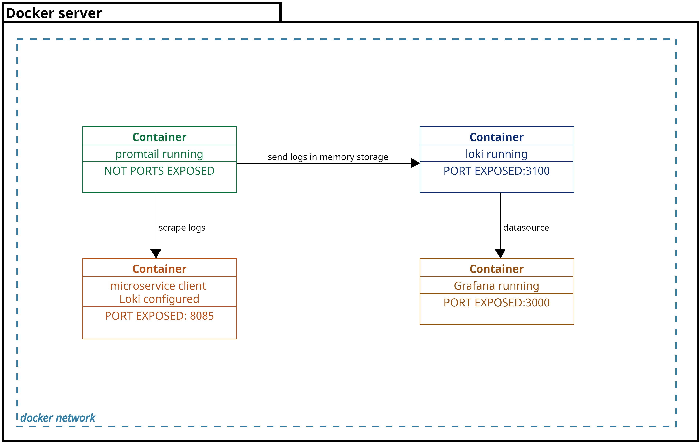
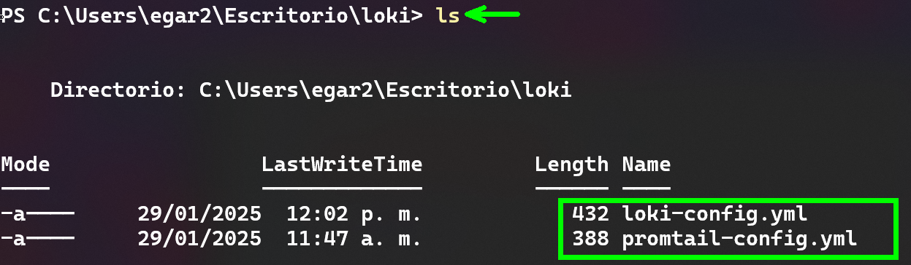
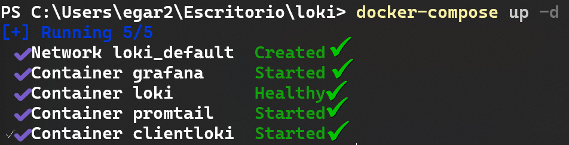
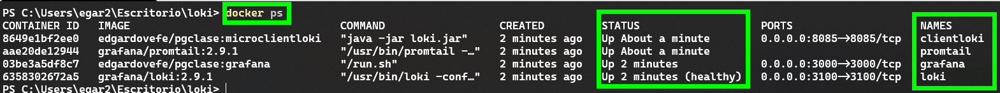
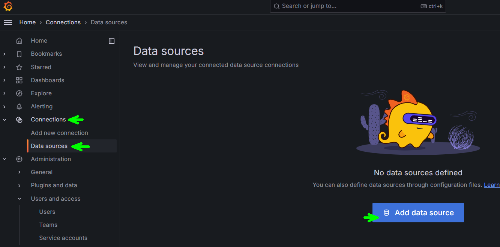
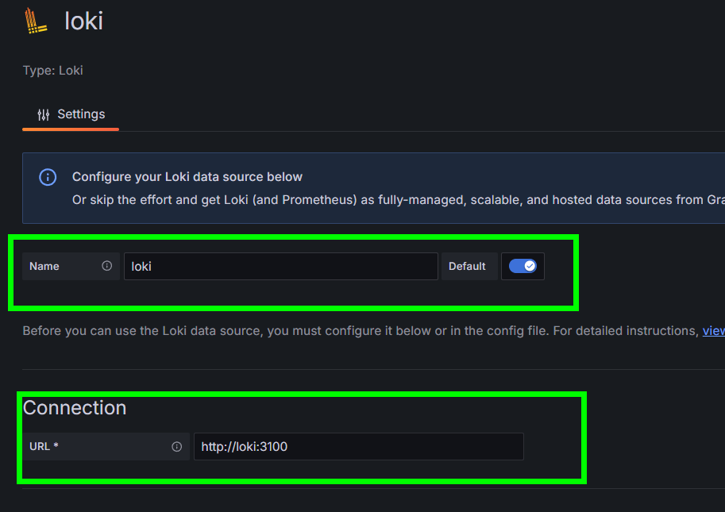
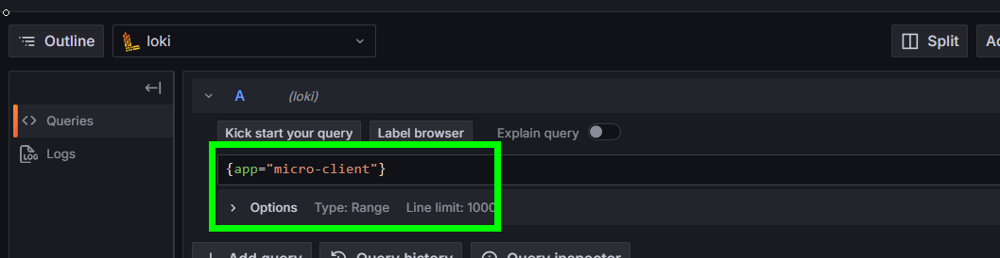
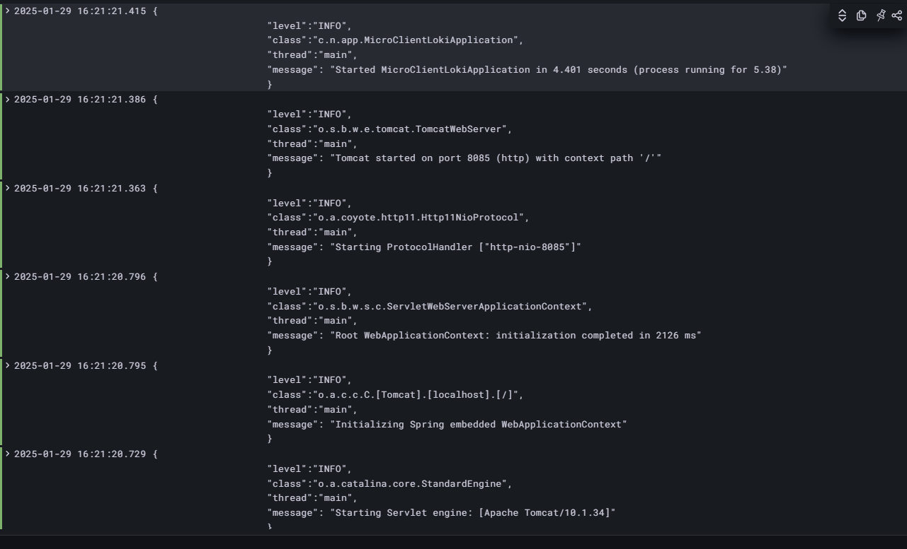

# 8. Implementación de Loki con microservicio
En este laboratorio se espera que el alumno pueda integrar un microservicio
en **spring-boot** con **Loki, promtail y grafana**

## Objetivos
- Implementar la configuración del microservicio
- Implementar la configuración de promtail
- Crear la configuración de loki
- Configurar loki como datasource en grafana

---

<div style="width: 400px;">
        <table width="50%">
            <tr>
                <td style="text-align: center;">
                    <a href="../Capitulo7/"></a>
                    <br>anterior
                </td>
                <td style="text-align: center;">
                   <a href="../README.md">Lista Laboratorios</a>
                </td>
<td style="text-align: center;">
                    <a href="../Capitulo9/"></a>
                    <br>siguiente
                </td>
            </tr>
        </table>
</div>


---


## Diagrama




> **IMPORTANTE:** Antes de comenzar este laboratorio asegurate que no tengas contenedores en ejecución. 


## Instrucciones
Este laboratorio esta dividido en la siguientes secciones: 

- **[Configuración microservicio cliente](#configuración-microservicio-cliente-return)**
- **[Archivo Configuración LOKI](#archivo-configuración-loki-return)**
- **[Archivo Configuración promtail](#archivo-configuración-promtail-return)**
- **[Docker compose](#docker-compose-return)**


## Configuración microservicio cliente [return](#instrucciones)
> **IMPORTANTE:** La imagen de docker **edgardovefe/pgclase:microclientloki** ya tiene las configuraciones expuestas en esta sección. Pero es importante saber que es lo que se debe de cambiar para que **loki** funcione. 

1. Añadir la siguientes dependencias en el microservicio cliente en el archivo **pom.xml**

```xml
<!--loki dependency-->
<dependency>
    <groupId>com.github.loki4j</groupId>
    <artifactId>loki-logback-appender</artifactId>
    <version>1.4.1</version>
</dependency>

<!--logging dependency-->
<dependency>
    <groupId>org.springframework.boot</groupId>
    <artifactId>spring-boot-starter-logging</artifactId>
</dependency>
```

2. Ahora en la carpeta **src/main/resources** crear un archivo
que llamaremos **logback-spring.xml** para controlar donde se envían
los logs de la aplicación. 

```xml
<?xml version="1.0" encoding="UTF-8"?>
<configuration>        
   <appender name="LOKI" class="com.github.loki4j.logback.Loki4jAppender">
        <http>
            <url>http://${IP_LOKI:-localhost}:3100/loki/api/v1/push</url>
        </http>
        <format>
            <label>
                <pattern>app=micro-client,host=${HOSTNAME},level=%level</pattern>
                <readMarkers>true</readMarkers>
            </label>
            <message>
                <pattern>
                    {
                    "level":"%level",
                    "class":"%logger{36}",
                    "thread":"%thread",
                    "message": "%message"
                    }
                </pattern>
            </message>
         </format>
     </appender>
     
     <root level="INFO">
        <appender-ref ref="LOKI" />
     </root>
</configuration>
```

> **NOTA:** La configuración anterior envía los logs a promtail
con un formato personalizado. 


3. Guardar el microservicio y generar de nuevo la imagen de docker

## Archivo Configuración LOKI [return](#instrucciones)
1. En el escritorio crearemos una carpeta que llamaremos **loki**
2. En la carpeta **loki** crearemos un archivo que llamaremos **loki-config.yml**
3. En el archivo añadiremos el siguiente contenido:

```yaml
auth_enabled: false

server:
  http_listen_port: 3100

common:
  ring:
    instance_addr: 127.0.0.1
    kvstore:
      store: inmemory
  replication_factor: 1
  path_prefix: /tmp/loki

schema_config:
  configs:
  - from: 2020-05-15
    store: tsdb
    object_store: filesystem
    schema: v13
    index:
      prefix: index_
      period: 24h

storage_config:
  filesystem:
    directory: /tmp/loki/chunks
```

> **NOTA:** La configuración anterior indica que loki almacenará
los logs en memoria y creará un índice cada 24 horas

4. Guardar el archivo y obtener su ruta absoluta

```bash
C:\Users\egar2\Escritorio\loki\loki-config.yml
```


## Archivo Configuración promtail [return](#instrucciones)
1. En la carpeta **loki** que se encuentra en el escritorio
crearemos un nuevo archivo que llamaremos **promtail.yml**

2. En el archivo **promtail-config.yml** añadiremos el siguiente contenido:

```yaml
server:
  http_listen_port: 9080
  grpc_listen_port: 0

positions:
  filename: /var/log/positions.yaml

clients:
  - url: http://loki:3100/loki/api/v1/push

scrape_configs:
  - job_name: spring-microservice
    static_configs:
      - targets:
          - host.docker.internal:8085
        labels:
          job: "microservice-client"
          __path__: /var/log/*.log
```

> **NOTA:** El archivo de configuración permite obtener los logs 
del microservicio cliente y enviarlos a **loki**
**promtail** funciona como un intermediario ya que **loki** no puede 
obtener directamente los **logs**

3. Guardar el archivo y obtener su ruta absoluta:

```bash
C:\Users\egar2\Escritorio\loki\promtail-config.yml
```


## Docker Compose [return](#instrucciones)
1. Antes de comenzar esta sección asegurate que en la carpeta **loki**
tengas los siguientes archivos:



2. Dentro de la carpeta **loki** crear un nuevo archivo que llamaremos **docker-compose.yaml**

3. En el archivo **docker-compose.yaml** añadiremos el siguiente contenido:

```yaml
services:
  loki:
    container_name: loki
    image: grafana/loki:2.9.1
    ports:
      - 3100:3100
    volumes:
      - '<path_loki_config>:/etc/loki/loki-config.yml'
    command: -config.file=/etc/loki/loki-config.yml
    healthcheck:
      test: wget -qO- http://localhost:3100/ready
    
  
  promtail:
    container_name: promtail
    image: grafana/promtail:2.9.1
    volumes:
      - '<path_promtail_config>:/etc/promtail/promtail-config.yml'
    command: -config.file=/etc/promtail/promtail-config.yml
    depends_on:
      loki:
        condition: service_healthy
  
  grafana:
    container_name: grafana
    image: edgardovefe/pgclase:grafana
    ports:
      - 3000:3000
    environment:
      - GF_SECURITY_ADMIN_PASSWORD=pass
  
  clientloki:
    container_name: clientloki
    image: edgardovefe/pgclase:microclientloki
    ports:
      - 8085:8085
    environment:
      - IP_LOKI=loki
    depends_on:
      loki:
        condition: service_healthy
```
> **IMPORTANTE:** En el archivo compose buscar **<path_loki_config> y <path_promtail_config>** y sustituirlo con las rutas de los archivos de configuración de **loki y promtail** 

4. Guardar el archivo **docker-compose.yaml**

5. Abrir una terminal y ejecutar el siguiente comando:

```bash
docker-compose up -d 
```

6. Al terminar de ejecutarse el comando deberías de observar un resultado como el siguiente:



7. Para validar que los contenedores estan up validar con el siguiente comando:

```bash
docker ps
```




## Resultado Esperado [instrucciones](#instrucciones)

1. Si todo se ha inicializado bien abrir el dashboard de grafana (http://localhost:3000)

2. Iniciar sesión al dashboard de grafana:
- **username**: admin
- **password**: pass

3. Conectar una nueva fuente de datos **Connections->Data Sources->Add data source**



4. Agregar a **loki** con la siguiente dirección: http://loki:3100



5. Salvamos la nueva conexión

6. En **Grafana** pulsamos **Explore**

7. Selecciona el datasource **loki**

8. En el query ejecutamos la siguiente consulta:

```bash
{app="micro-client"}
```



9. Al ejecutar la consulta deberiamos de observar el siguiente resultado:

