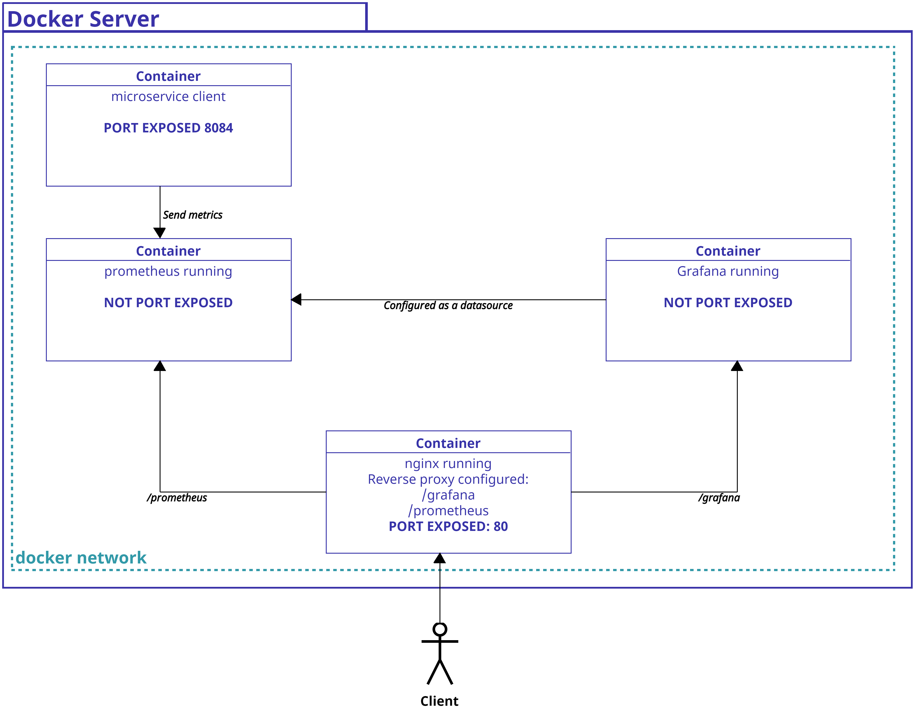
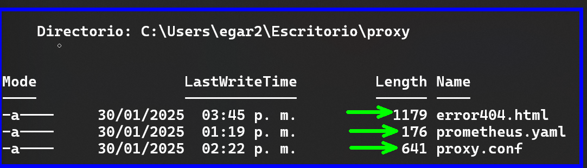
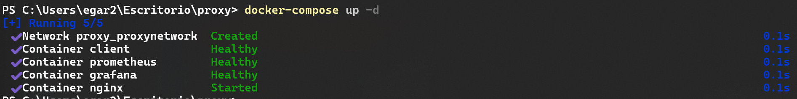
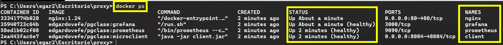
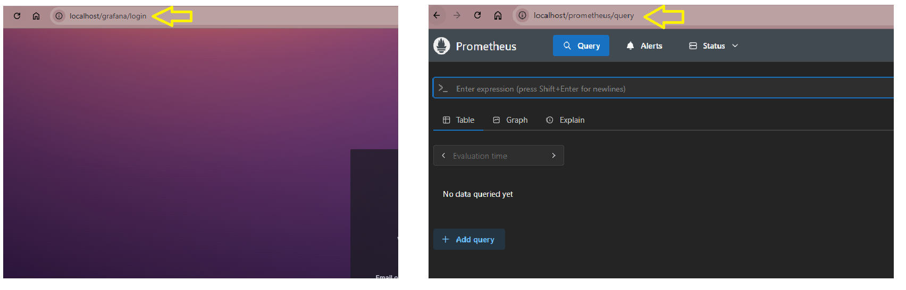

# 9. Implementando reverse proxy en prometheus y grafana

Para proteger prometheus y grafana necesitaremos implementar un reverse proxy que nos permitira controlar la entrada a nuestros servicios. 

## Objetivos
- Configuración de nginx
- Configuración de un reverse proxy en nginx
- Configuración de grafana y prometheus para un reverse proxy
- Usar docker compose para levantar las aplicaciones. 

---

<div style="width: 400px;">
        <table width="50%">
            <tr>
                <td style="text-align: center;">
                    <a href="../Capitulo8/"></a>
                    <br>anterior
                </td>
                <td style="text-align: center;">
                   <a href="../README.md">Lista Laboratorios</a>
                </td>
<td style="text-align: center;">
                    <a href="../Capitulo10/"></a>
                    <br>siguiente
                </td>
            </tr>
        </table>
</div>


---


## Diagrama




## Instrucciones
Este laboratorio esta dividido en las siguientes secciones: 

- **[Configuración nginx](#configuración-nginx-return)**
- **[Configuración prometheus](#configuración-prometheus-return)**
- **[Docker Compose](#docker-compose-return)**


## Configuración nginx [return](#instrucciones)
1. Crear una carpeta en el escritorio que llamaremos **proxy**

2. Dentro de la carpeta **proxy** crear un archivo con el nombre **proxy.conf** y añadir el siguiente contenido:

```conf
upstream backendprometheus {
    server prometheus:9090;
}
upstream backendgrafana {
    server grafana:3000;
}

server{
    listen 80;
    server_name localhost;
    

    location /prometheus/ {
        proxy_pass http://backendprometheus;
        proxy_set_header Host $host;
        proxy_set_header X-Real-IP $remote_addr;
    }
    location /grafana/ {
        
        proxy_pass http://backendgrafana;
        proxy_set_header Host $host;
        proxy_set_header X-Real-IP $remote_addr;
    }

    error_page 404 /error404.html;
    location = /error404.html {
        root /usr/share/nginx/html;
    }
}
```

> **NOTA**: En la configuración anterior se implementa el proxy
para **prometheus y grafana**

3. En la carpeta **proxy** crear otro archivo que llamaremos
**error404.html** que nos servirá para personalizar la página de error
de nginx

4. En el archivo **error404.html** añadir el siguiente contenido:

```html
<!DOCTYPE html>
<html lang="en">
<head>
    <meta charset="UTF-8">
    <meta name="viewport" content="width=device-width, initial-scale=1.0">
    <title>NOT_FOUND</title>
    <!--link bootstrap-->
    <link href="https://cdn.jsdelivr.net/npm/bootstrap@5.3.3/dist/css/bootstrap.min.css" rel="stylesheet" integrity="sha384-QWTKZyjpPEjISv5WaRU9OFeRpok6YctnYmDr5pNlyT2bRjXh0JMhjY6hW+ALEwIH" crossorigin="anonymous">
</head>
<body>

    <nav class="navbar bg-primary">
        <div class="container-fluid">
            <h2 class="display-5" style="color: aliceblue;">ERROR PAGE</h2>
        </div>
    </nav>
    <br>
    <br>
    <br>
    <br>
    <div class="container-fluid" style="max-width: fit-content; margin-left: auto; margin-right: auto;" >
       
       <h2 class="display-4">prueba con /grafana ó /prometheus</h2>
    </div>

<!--script bootstrap-->
<script src="https://cdn.jsdelivr.net/npm/bootstrap@5.3.3/dist/js/bootstrap.bundle.min.js" integrity="sha384-YvpcrYf0tY3lHB60NNkmXc5s9fDVZLESaAA55NDzOxhy9GkcIdslK1eN7N6jIeHz" crossorigin="anonymous"></script>
</body>
</html>
```

5. Guardar todo y obtener sus rutas absolutas (la usaremos más adelante)

```bash
#path_proxy.conf
C:\Users\egar2\Escritorio\proxy\proxy.conf

#path_error404.html
C:\Users\egar2\Escritorio\proxy\error404.html
```


## Configuración prometheus [return](#instrucciones)
1. Dentro de la carpeta **proxy** crear un archivo que llamaremos 
**prometheus.yaml**

2. Dentro del archivo **prometheus.yaml** añadiremos lo siguiente:

```yaml
scrape_configs:
  - job_name: 'microservice-client'
    metrics_path: '/actuator/prometheus'
    scrape_interval: 5s
    static_configs:
      - targets: ['client:8084']
```

3. Guardaremos todo y obtendremos su path absoluto

```bash
C:\Users\egar2\Escritorio\proxy\prometheus.yaml
```


## Docker Compose [return](#instrucciones)
1. Antes de comenzar esta sección asegurate que en la 
carpeta **proxy** tengamos los siguientes archivos:



2. En la carpeta **proxy** crear un archivo que llamaremos **docker-compose.yaml**

3. En el archivo **docker-compose.yaml** añadiremos el siguiente contenido:

```yaml
services:

  client:
    container_name: client
    image: edgardovefe/pgclase:microclient
    networks:
      - proxynetwork
    ports:
      - 8084:8084
    healthcheck:
      test: curl -f http://localhost:8084/client

  prometheus:
    container_name: prometheus
    image: edgardovefe/pgclase:prometheus
    networks:
      - proxynetwork
    volumes:
      - <path_prometheus.yaml>:/etc/prometheus/prometheus.yml
    command:
      - "--config.file=/etc/prometheus/prometheus.yml"
      - "--web.external-url=/prometheus/"
    depends_on:
      client:
        condition: service_healthy
    healthcheck:
      test: wget -qO- http://localhost:9090
    
  grafana:
    container_name: grafana
    image: edgardovefe/pgclase:grafana
    networks:
      - proxynetwork
    environment:
      - GF_SECURITY_ADMIN_PASSWORD=pass
      - GF_SERVER_ROOT_URL=http://localhost/grafana/
      - GF_SERVER_SERVE_FROM_SUB_PATH=true
    depends_on:
      prometheus:
        condition: service_healthy
    healthcheck:
      test: curl -f http://localhost:3000


  nginx:
    container_name: nginx
    image: nginx:1.24
    ports:
      - 80:80
    networks:
      - proxynetwork
    volumes:
      - <path_error404.html>:/usr/share/nginx/html/error404.html
      - <path_proxy.conf>:/etc/nginx/conf.d/default.conf
    depends_on:
      prometheus:
          condition: service_healthy
      grafana:
          condition: service_healthy
    
networks:
  proxynetwork:
    ipam:
      config:
        - subnet: 192.168.16.0/24
          gateway: 192.168.16.1
        
```

> **NOTA:** Dentro del **yaml del docker-compose** debemos buscar **<path_prometheus.yaml>, <path_error404.html> y <path_proxy.conf>** y sustituirlos con las rutas copiadas en las secciones anteriores. 


4. Guardar todo

5. Abrir una terminal en la carpeta **proxy**

6. Ejecutar el siguiente comando

```bash
docker-compose up -d
```
> **NOTA:** El comando es posible que tarde un poco porque se deben iniciar todos los contenedores en un orden predeterminado para que funcionen. 


7. Al terminar de ejecutarse el comando deberías de observar lo siguiente:



8. Validar que los contenedores este iniciados con el comando:

```bash
docker ps
```




## Resultado esperado

Si hemos llegado hasta este punto abriremos a grafana y prometheus desde el proxy:

- **URL Grafana:** http://localhost/grafana

- **URL Prometheus:** http://localhost/prometheus

